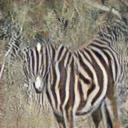

## single-image-cycleGAN
Unpaired image-to-image translation with cycleGAN using Keras. (Translate an image from domain A to domain b and vice versa.)

input  | 128 | 256 |  512
:-------------------------:|:-------------------------:|:-------------------------:|:-------------------------:
|||
|||
|||
    

The model for this horse_2_zebra example was trained for 200 epochs on 90% of the training set (960 images) with an input size of 128x128 pixel.    
(Obviously, the generator for B->A needs more training for this example.)
    
**Note**    
Model not included. Create directories (in  main repo dir)
- /model
- /model/checkpoints

See also:
- https://junyanz.github.io/CycleGAN/
- https://keras.io/examples/generative/cyclegan/
- https://machinelearningmastery.com/cyclegan-tutorial-with-keras/
- https://github.com/eriklindernoren/Keras-GAN/blob/master/cyclegan/cyclegan.py
- https://github.com/mronta/CycleGAN-in-Keras