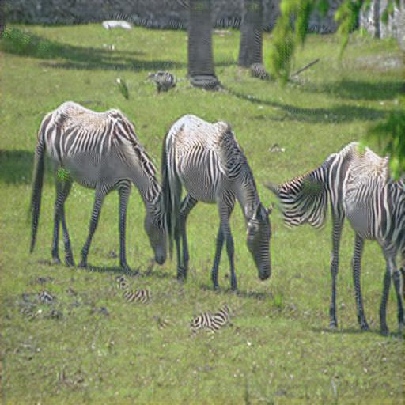

## single-imgae-cycleGAN
Unpaired image-to-image translation with cycleGAN using Keras.

See: https://junyanz.github.io/CycleGAN/

input  | 128 | 256 |  512
:-------------------------:|:-------------------------:|:-------------------------:|:-------------------------:
|||
|||
|||

xxx